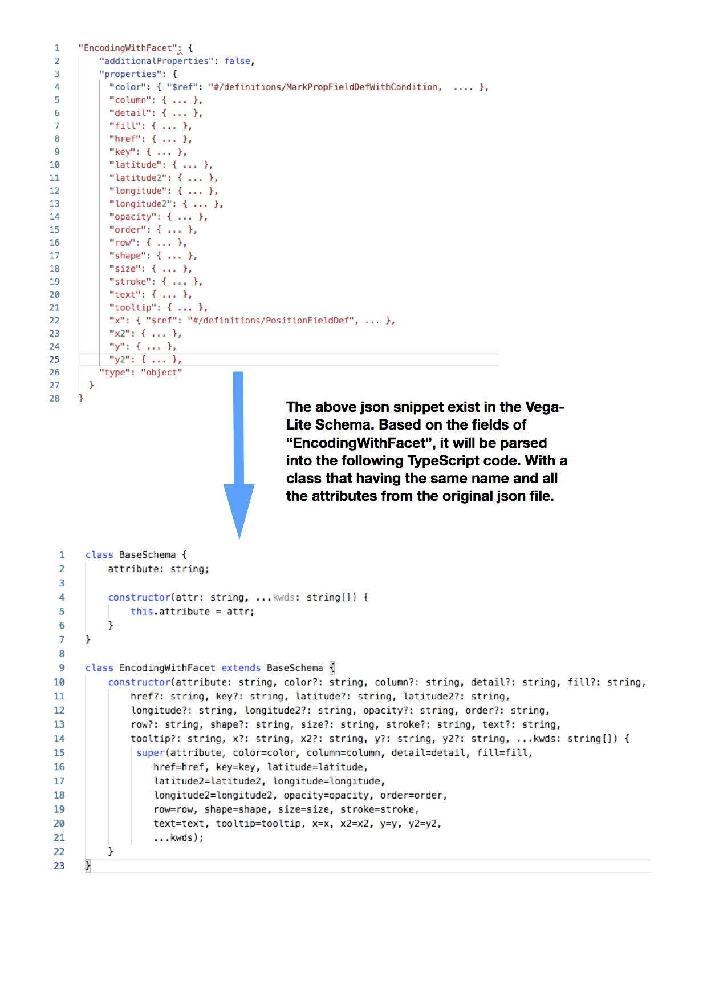
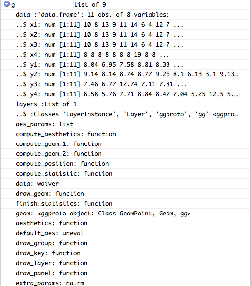

# Proposal for GSoC (Draft)

## Project Info

**Title**: Translator from ggplot2 to Vega Lite

**Link**: [Here](https://github.com/rstats-gsoc/gsoc2019/wiki/Translator-from-ggplot2-to-Vega-Lite)

## About Me

Currently a third year computer science student studying at UNSW. I have a great passion for participating in open source project, would love to contribute to R community and make it better. I will be totally free during this summer, and I'm able to give undivided atttention to this project to ensure it's outcome meets expectation. I'm skilled at the following areas:
+ Solid data structure and algorithms knowledge, be able to produce high quality code in terms of code efficiency and readability.
+ Mainly use Python and Haskell in my daily programming tasks, but I can also produce elegant and consise TypeScript code if this project requires.
+ Be able to work under pressure and with limited outside help. 
+ Strong self-learning skills and totally self-motivated.

## Contact Info

**Name**: Yu Xia (preferred name: Kurt)

**Postal address**: 5 Defries Ave, Zetland NSW 2017, Australia

**Telephone**: +61 449650714

**Email**: `entropy714@gmail.com` (the one registered on google system),  `z5212108@ad.unsw.edu.au` (preferred one)

## Student Affiliation

**Institution**: UNSW (University of New South Wales)

**Program**: Bachelor of Computer Science

**Stage**: Third year

## Schedule Conflicts

No conflicts. No other internships during summer. I would be able to spend at least 40 hours per week working on the project (Monday - Friday, 8 hours per day, can also work on weekend if the progress is behind schedule).

## Coding Plan

The technical stack I plan to use in this project includes TypeScript (for parsing the Vega-Lite Schema and automatically generate corresponding object hierarchy, which mirrors the JSON schema definition), V8 (use it to transfer data between TypeScript and R) and also R. 

The reason I choose TypeScript is that it supports better OOP style and it can be eaiser to deal with JSON files compared with R itself. The other important reason is that this project should not only benefit the R community, but it should improve JavaScript visualization library as well. I believe when this project is finished, R users should be able to convert a ggplot2 object to Vega-Lite Spec, TypeScript (or JavaScript) users will also have a fairly nice API to Vega-Lite. They can write purely JavaScript code to generate Vega-Lite plots.

I plan to achieve the goal by dividing this project into the following two stages.

**Step 1: Vega-Lite Schema Parser (Written in TypeScript)**

This step uses the same approach Altair (Python) does. Based on the JSON Schema, we generate the same class hierarchy in TypeScript.



After this stage is done, we should get a nice interface from TypeScript to Vega-Lite. Users will be able to write TypeScript (or JavaScript) code to produce vega-lite specs.

```typescript
// For example, user can write something like this:

// With high level API:
const encode = encode(x='x1:Q',y='y1:Q',color='Origin:N');

// Or, with low level API:
let x = new PositionFieldDef(field='x1', type='quantitative');
let y = new PositionFieldDef(field='y1', type='quantitative');
let color = new MarkPropFieldDefWithCondition(field='Origin', type='nominal');
const encode = encode(x = x, y = y, color = color);
```

Then, go through the attributes of each class, we can produce the following spec:

```json
{
    "encoding": {
        "color": {
            "field": "x1",
            "type": "quantitative"
        },
        "x": {
            "field": "y1",
            "type": "quantitative"
        },
        "y": {
            "field": "Miles_per_Gallon",
            "type": "quantitative"
        }
    }
}
```

Those classes are automatically generated from Vega-Lite Schema, which means it will evolve even the original schema changes.

**Step 2: Extract ggplot2 object to produce TypeScript code**

At this stage, we should already obtain a fully featured TypeScript interface to Vega-Lite Schema. Then we need to make a connection from ggplot to TypeScript. I plan to achieve that goal by extracting out the attributes from a ggplot2 object, and automatically generate TypeScript code based on those attributes. Since each ggplot plot is a list-based object, by iterating through the list and check if each element (layer, facet, color ...) is `NULL` or not, create corresponding TypeScript object. For example, assume we have the following plot:

```R
g = ggplot(anscombe, aes(x = x1, y = y1)) + geom_point()
```

The internal structure of this plot is:



By iterating thtough this list, if we find there is value (not `NULL`, or have some parameters in function) associated with an attribute, then we create the same TypeScript object. 

```TypeScript
// The data in the ggplot will be extract out
// and create the following object:
let data = new Data(d);

// The layers will be extract out 
// and create the following object:
let x = new PositionFieldDef('x1', 'quantitative');
let y = new PositionFieldDef('y1', 'quantitative');

// If the color is specified in ggplot object
// the following TypeScript code probably will be generated:
let color = new MarkPropFieldDefWithCondition('Origin', 'nominal');
```

At the end, all those genereated low level objects will be put together and create a base class object.

```TypeScript
let plot = new BaseSchema(data=data, x=x, y=y, color=color ...);
```

Finally, call the function `to_spec()` to return the Vega-Lite Spec.

Although the TypeScript code is auto generated, but the ggplot attribute name is not the same as TypeScript class name, which means we need a mapping relation between those names, so that when our code encounters a value, it konws which TypeScript it should generete.

## Timeline

| Time      |           Work on                   | Milestone  |
|---------  |:-----------------------------------:| ----------:|
| Week 0    | TypeScript class hierarchy planing | |
| Week 1    | generating classes from Schema (include document)  | step 1 start |
| Week 2    | continue the work from week 1 | |
| Week 3    | generate test suits | |
| Week 4    | Test, Refine & Review | step 1 done |
| Week 5    | define mapping relationship between different names | step 2 start|
| Week 6    | extract ggplot attributes and generate typescript |  |
| Week 7    | continue the work from week 6 | |
| Week 8    | continue the work from week 6| |
| Week 9    | test step 1 and step 2 as a whole | |
| Week 10   | continue testing & debugging | step 2 done |
| Week 11   | write document for R package | project done |
| Week 12   | deploying & evaluating | |


## Management 

I will be totally free during this summer, and can put all my energy into this project. I plan to commit daily, at least five times per week (Monday - Firday). Possible commiting time would be 20.00pm - 24.00pm, Sydney time.

I will also check the github page daily, to ensure important message from mentor will be read as soon as possible. My response time for email usually would be within 24 hours.

## Test
[My attempted answer to all three tests.](https://observablehq.com/@kurt/gsoc-project-test/2)
